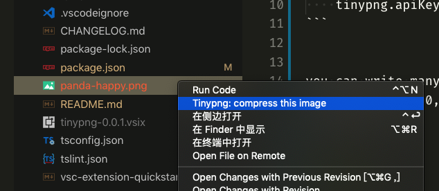
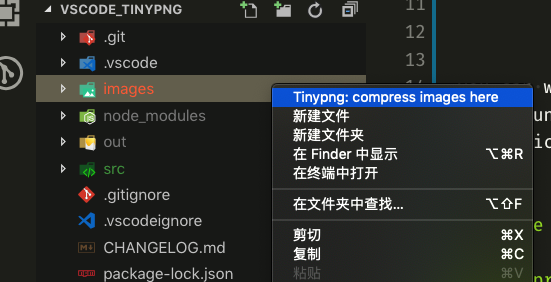

# Tinypng with many keys

## Requirements:

you need to have at least an apiKey to use this extension. to have it, go [Tinypng](https://tinypng.com/developers)

when you have the **API key**, go to the settings of VSCode.

```
    tinypng.apiKeys: ['your own apiKey']
```


you can write many keys, when the first one is up to the amount of 500, it will use the next one Automatically.


## Usage

### compress a image




### compress a folder




# Thanks for [andi1984](https://github.com/andi1984/vscode-tinypng)


